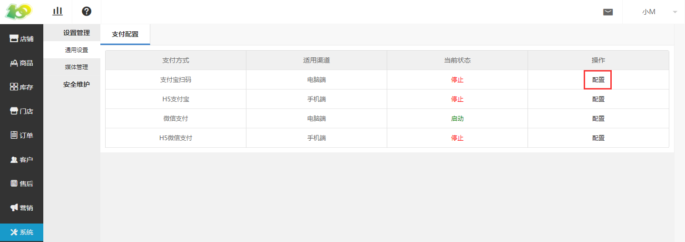
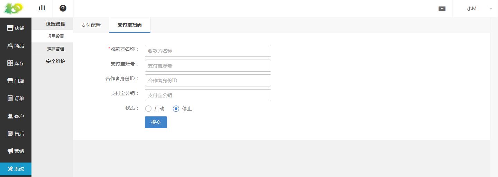
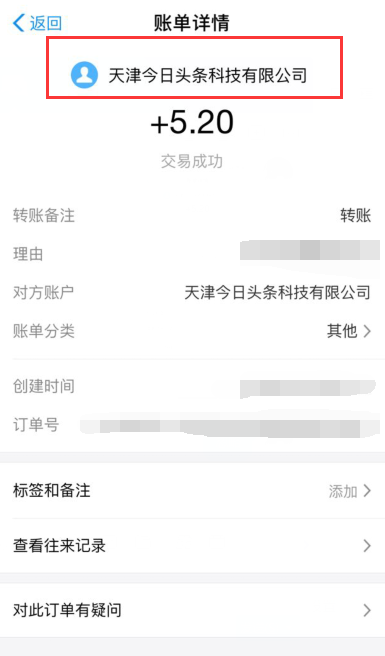
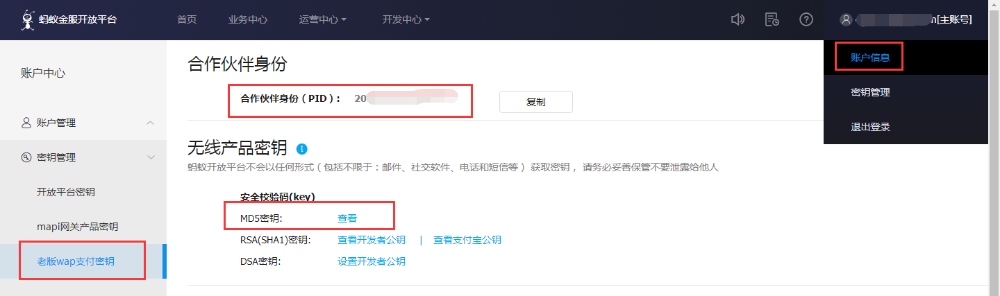

# (1)支付宝扫码配置

* 点击 系统-设置管理-通用设置-支付配置-支付宝扫码-配置 进行设置

* 收款方名称：显示在下方红框位置的信息，会在支付宝消息中提醒

*   支付宝账号：即登录支付宝所用的账号

*   合作者身份ID：点击 右上角账户管理-老版wap支付秘钥-合作伙伴身份（PID） ，复制到后台即可

*   支付宝公钥：点击 右上角账户管理-老版wap支付秘钥-MD5秘钥 ，复制到后台即可

