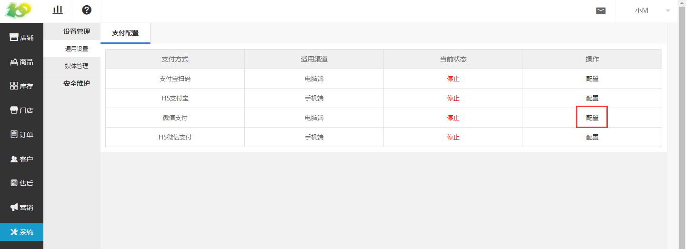
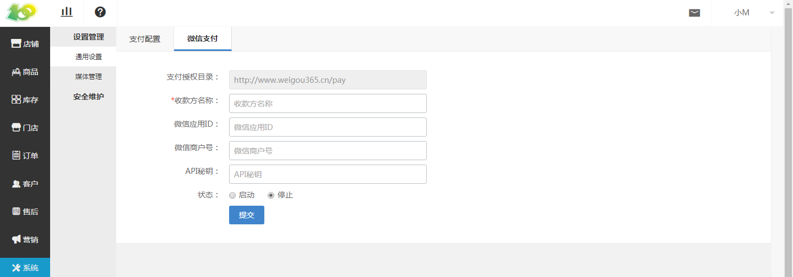
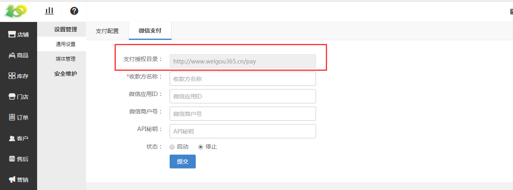
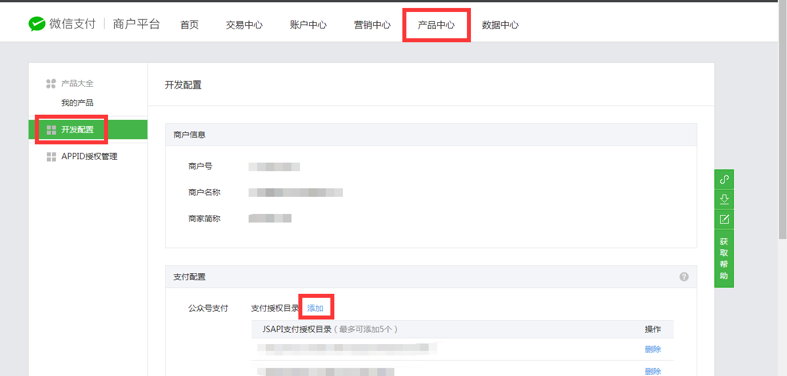
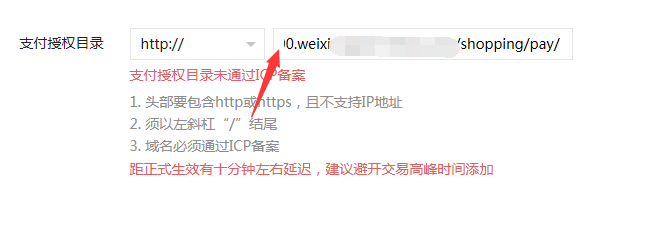
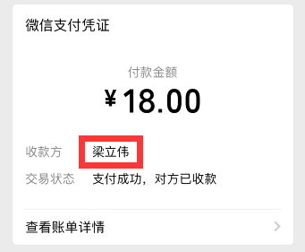
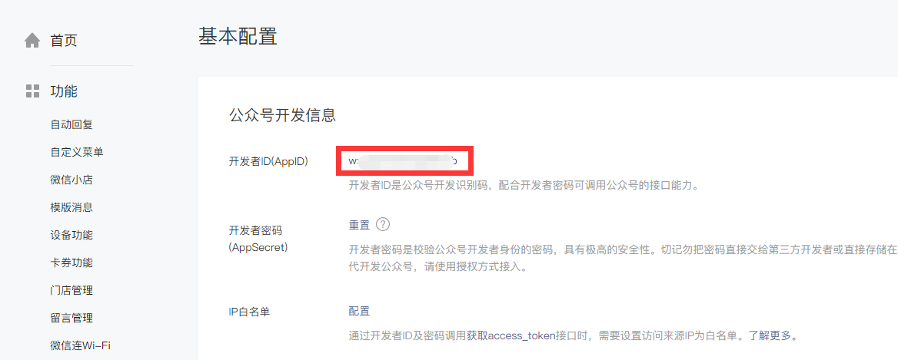
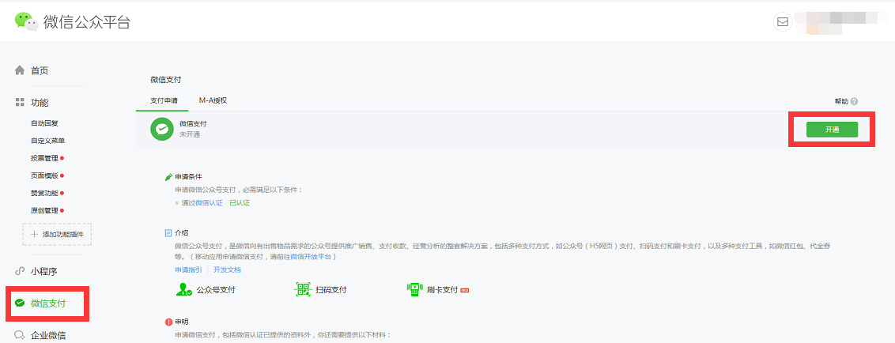
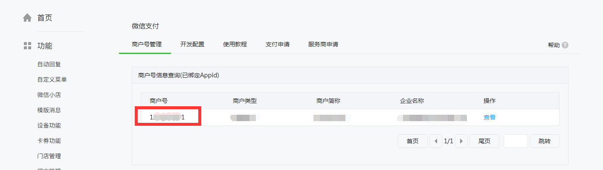
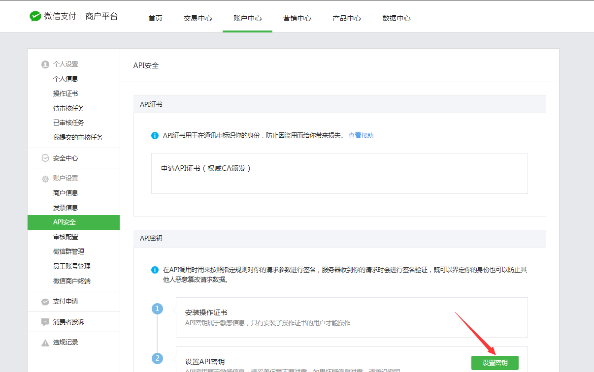

# (3)微信支付配置

* 点击 系统-设置管理-通用设置-支付配置-微信支付-配置 进行设置

支付授权目录：

*   把红框里的信息复制下来（虽然是灰色文字，但是可以复制的）

*   在 [微信支付平台](https://pay.weixin.qq.com/) ，若没有账号，则注册一个

*   点击 产品中心-开发配置

*   在 下方的支付配置中，点击 添加 把刚刚复制的信息添加进去

* 注意复制的时候，前方的“http://”不要重复了

* 收款方名称：显示在下方红框位置的信息，会在微信消息中提醒

* 微信应用ID：登录[微信公众号平台](https://mp.weixin.qq.com/)，在左侧导航栏找到 基本配置 这一条把右图红框中的APPID，复制到厨百的微信应用ID即可。

* 微信商户号：登录[微信公众号平台](https://mp.weixin.qq.com/)，点击左侧导航栏处的微信支付

    * 若没开通的话，开通一下
    * 若开通了，复制微信商户号到厨百的微信支付商户号即可

* API秘钥：登录[微信支付平台](https://pay.weixin.qq.com/)，点击 账户中心-API安全

* 点击设置秘钥，然后把设置的秘钥复制到厨百的API秘钥处

* 状态：若开启的话即可使用微信支付，若停止的话则不可使用微信支付，根据需求选择即可。

