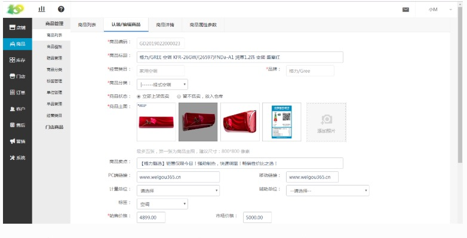
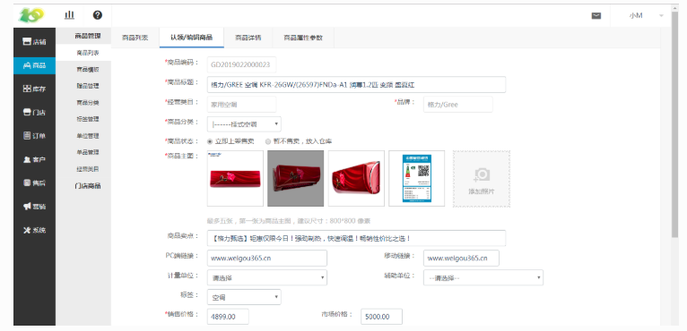
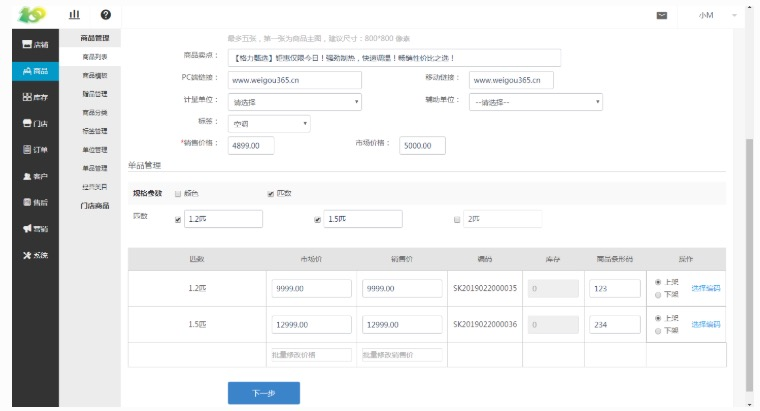
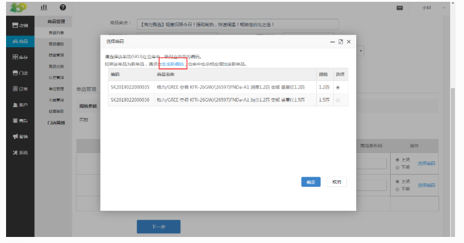
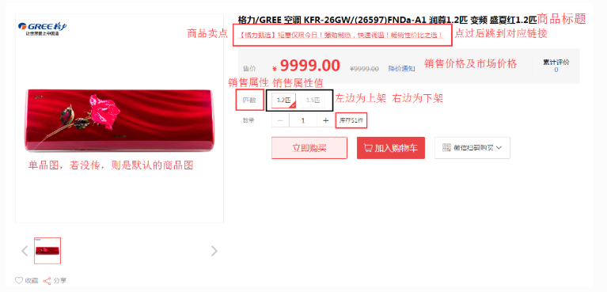
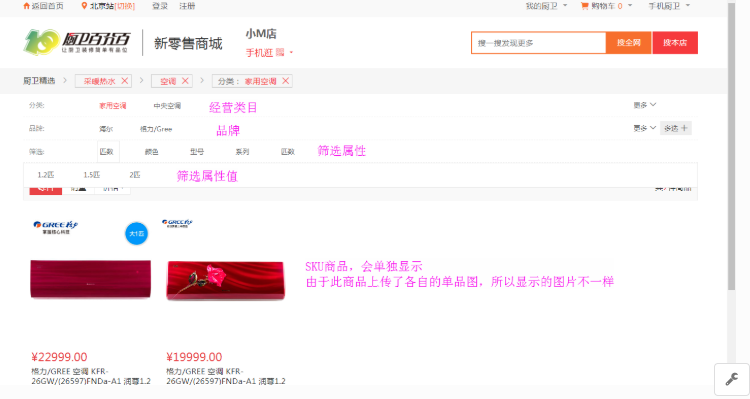

# (1)编辑商品
*   商品编码：前台不会显示，后台会自动编码

*   商品标题：按需填写即可，可借鉴下图中的商品标题

*   经营类目：会自动调取此商品的经营类目

*   品牌：会自动调取此商品的品牌信息

*   商品分类：通过 商品设置-商品管理-商品分类 进行创建后，选择即可

*   上架时间：根据个人需求选择，放入仓库的商品前台不会显示，实际上就是下架

*   商品主图：点击 添加照片-点击上传-添加-保存-选择-保存 即可

*   商品卖点：可见下图中的具体位置，显示为红色文字

*   PC端链接：必须是本网站下的链接，电脑点过链接文字后跳转的链接

*   移动链接：必须是本网站下的移动端的链接，移动端点过链接文字后跳转的链接

*   计量单位：前台暂时不会显示，选择后，后台浏览使用

*   辅助单位：前台暂时不会显示，选择后，后台浏览使用

*   标签：通过 商品-商品管理-标签管理 进行创建后，选择即可

*   销售价格、市场价格、初始库存：

若商品是SPU商品，则在此处填写

若商品是SKU商品，则在下方选择过规格参数后，进行填写即可

*   在规格参数中，可以选择商品的销售属性，即前台选择商品的地方，可看下图

*   市场价、销售价：会在前台显示，详情见下图介绍

*   编码：SKU编码，选择编码后，会在此处显示

*   库存：需在进销管理中添加商品库存信息，此处仅显示

*   商品条码：即商品上自带的条码信息，手动输入，扫码枪输入均可

*   选择编码：点击生成新编码即可，勾选确定后，在编码处，即会自动填写

*   上架下架：选择上架商品会在前台售卖，若选择下架即在前台不可购买

* 在前台的显示情况：

