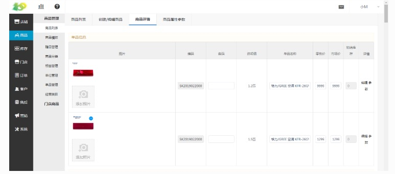
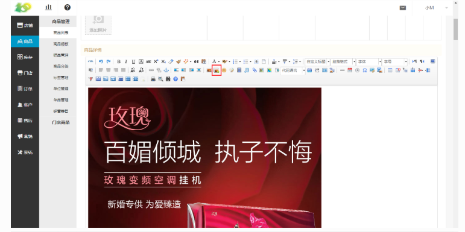
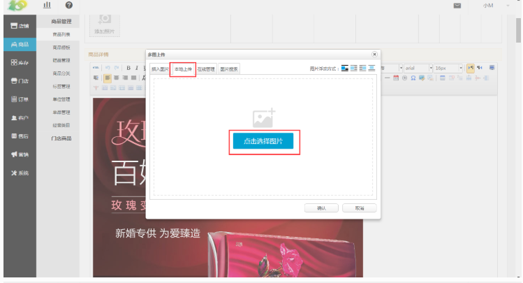
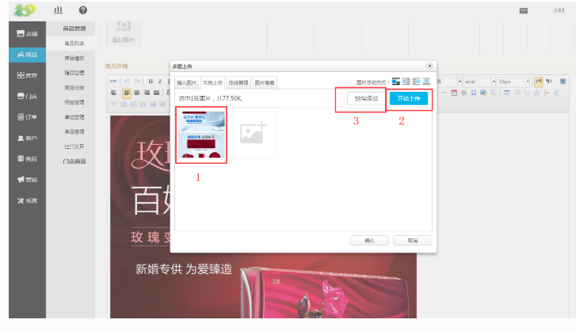

# (2)商品详情
*   举个例子：假如在卖的商品为一件T恤，有白色和黑色的两种

*   图片：为单品图，即SKU商品上传此图片后，商品主图就显示这个，可不上传

*       一个要上传白色T恤的图片，另一个要上传黑色T恤的图片

*   选项值：即销售属性值，可见上图中的提示文字

*       一个显示白色，一个显示黑色

*   单品名称：修改后，选择过销售属性值之后，即显示对应的商品标题

*       一个设置的名称为“白色T恤”，一个设置“黑色T恤”

*   编辑：点过后，设置此SKU商品的详情页

*       “白色T恤”和“黑色T恤”如果要显示不同详情页的话，在此处更改即可，若不作修改此处会显示默认的详情页，即下方设置的详情页

*   参数：此处修改商品的规格参数，例如商品的型号、品牌、尺寸、重量信息

*       此处若是设置颜色参数的话，“白色T恤”的就应设置颜色为白色，“黑色T恤”的就应设置颜色为黑色

*   商品详情：点击下图红框中的多图上传的按钮，可进行详情页的上传，下图中有具体的操作顺序

