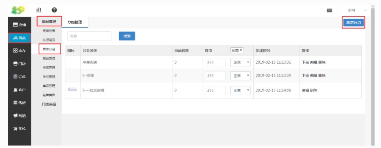
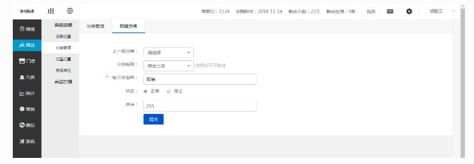
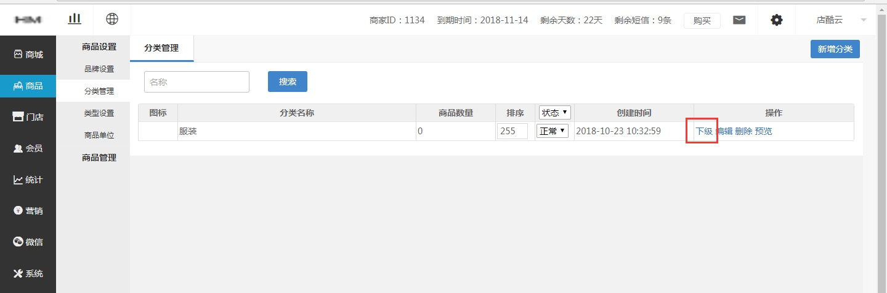
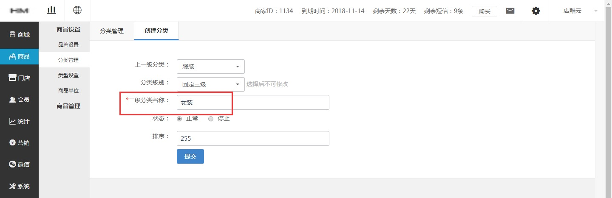
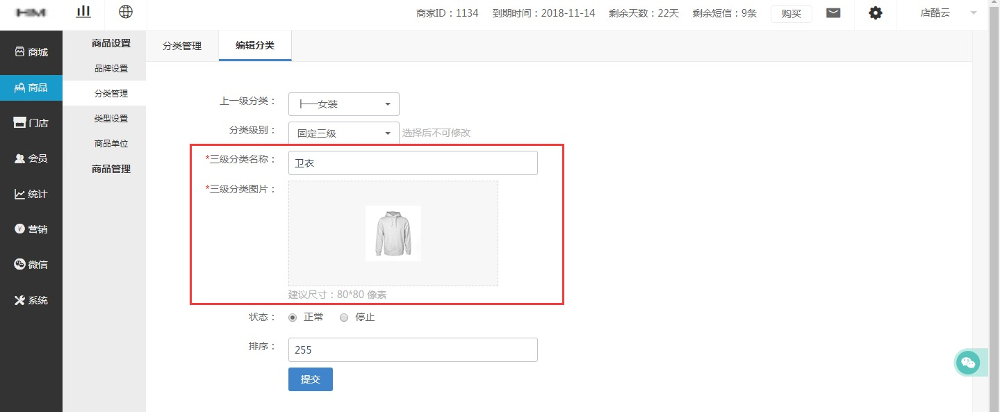

# (1)新增分类
* 点击 商品-商品管理-商品分类-新增分类 进行分类的增加

*   注意事项：最好提前规划好分类

*   上一级分类：选择所需创建分类的上一级分类，若创建一级分类则选择“请选择”

*   分类级别：固定二级，例如“服装-女装”这样的是两级

固定三级，例如“服装-女装-卫衣”这样的是三级

*   一级分类名称：例如“服装-女装-卫衣”，一级分类名称就是“服装”

*   状态：选择为“停止”状态时，分类在前台不会显示，并且创建不了该分类的商品

*   排序：排序的序号越小，分类的排序越往前

*   若创建过一级分类后，创建该分类下的下级分类

*   点击 商品-商品设置-分类管理-下级 进行下级分类的创建

* 点过“下级”后只需填写红框中的内容

* 点击二级分类的“下级”后，填写红框中的内容即可

