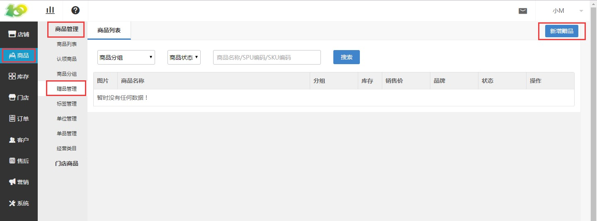
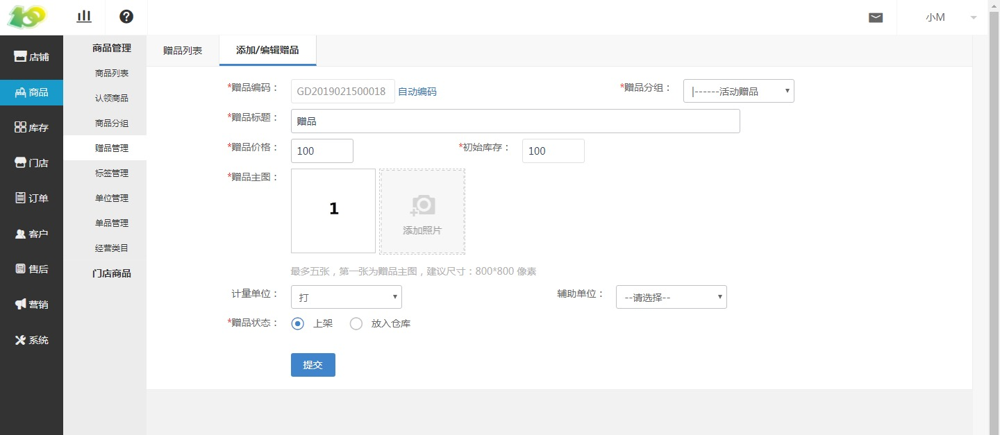

# (2)创建赠品

* 点击 商品-商品管理-赠品管理-新增赠品 进行赠品的添加

*   赠品编码：前台不会显示，点击自动编码即可，也可自己输入编码

*   赠品分类：前台会显示，在筛选的地方显示

*   赠品标题：在绑定活动的赠品时，前台后台均会显示，按需填写即可

*   赠品价格：前台不会显示，功能中也不会出现，只是单纯的浏览作用

*   初始库存：若库存为0时，则用户不能再领取该赠品

*   赠品主图：前台会显示，图片尺寸最好上传800\*800px

*   计量单位：前台暂时不会显示，选择后，后台浏览使用

*   辅助单位：前台暂时不会显示，选择后，后台浏览使用

*   赠品状态：
    若选择“上架”，则可以在活动中绑定该赠品
    若选择“放入仓库”，则不可以在活动中绑定该赠品

