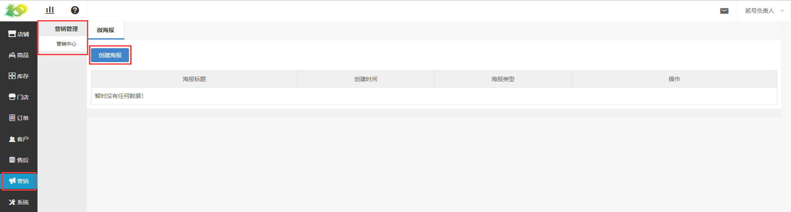
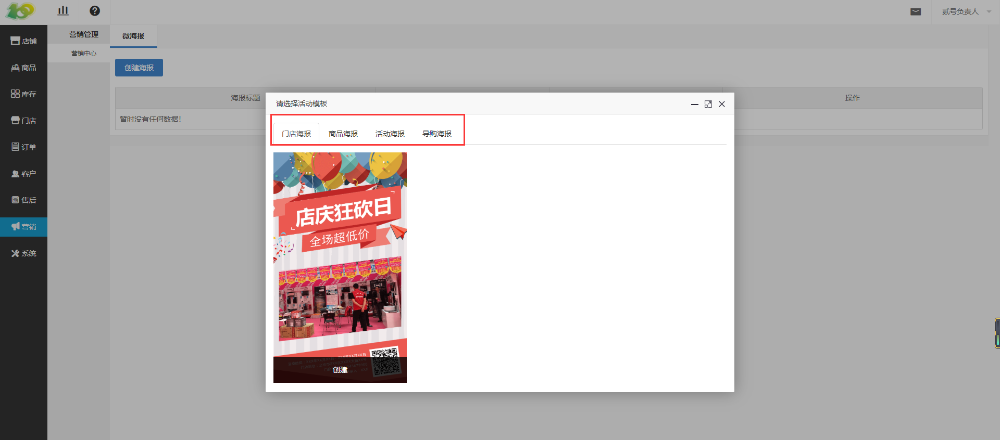
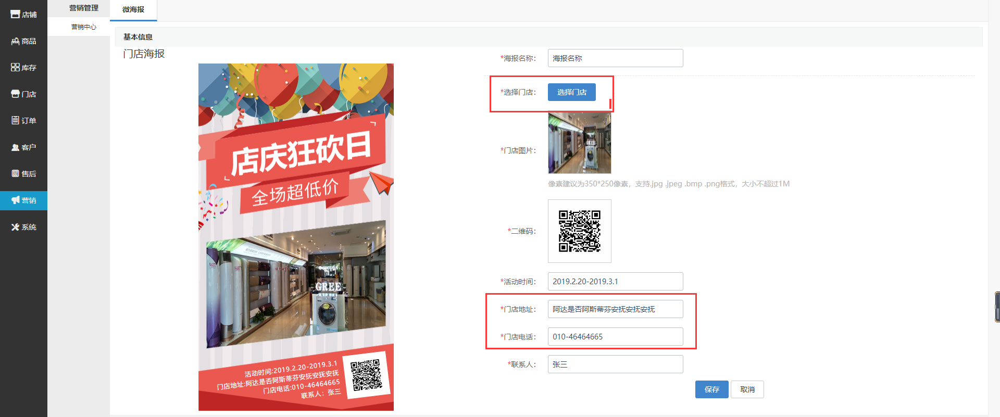

# (1)创建微海报

* 点击 营销-微海报-创建海报 ，进行微海报的创建

*   有四种海报可供选择，选择过海报类型之后，在合适的海报图片下点击创建

*   根据提示文字进行填写即可

*   有些信息会自动填充，比如选择门店后，门店地址和门店电话

注意事项：

*   其中只有活动海报需要手动上传二维码，其余三个活动仅需选择对应的门店、商品、导购，就会自动选择相对应的二维码。

*   活动二维码，在创建的活动列表中，下载即可

