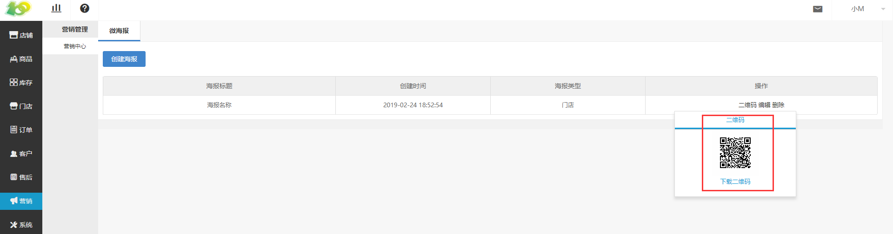

# (2)使用微海报

*   鼠标放在二维码处，点击 下载二维码 ，可下载微海报的二维码，微信扫描识别即可

*   用户在微海报中，长按图片，点击 识别图中二维码 即可进入二维码设定的页面

*   下图中的示例为门店海报，用户在 识别二维码 后，进入的页面如下图所示

*   大家在使用时，可保存微海报的图片，然后发到朋友圈，有兴趣的用户，长按图片扫描二维码，就会进入咱们设定的页面，成功进行宣传

