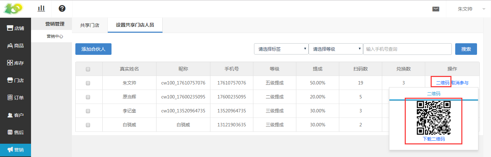
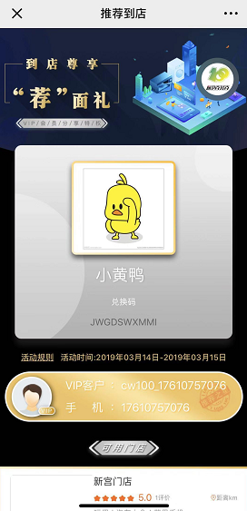
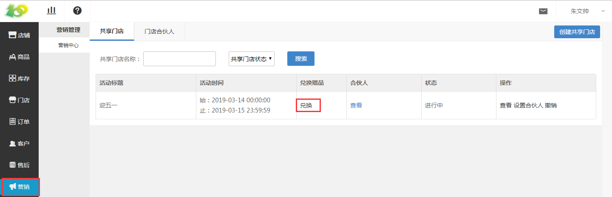
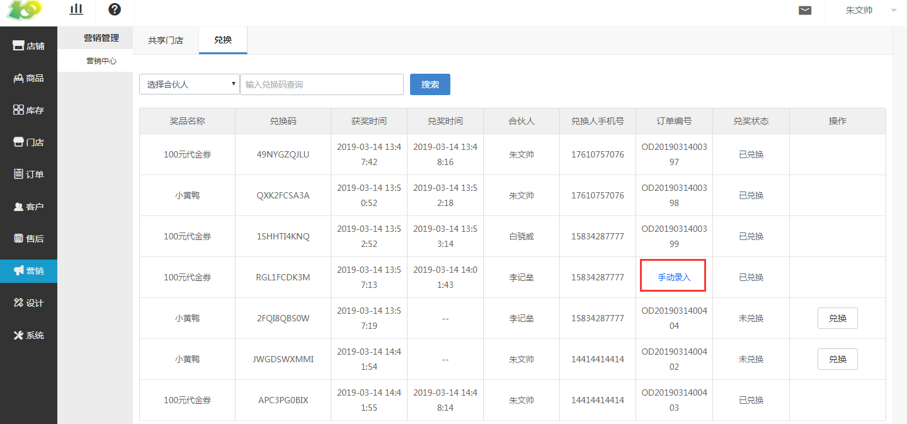
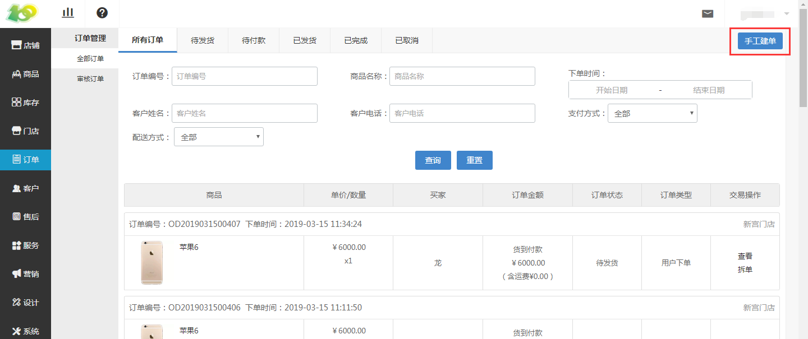

# (4)使用共享门店营销工具

*   最初导购通过录入合伙人，进行绑定门店合伙人，见上方操作

*   合伙人通过让消费者扫描自己的二维码，进入到推荐到店的奖品领取页面

    *   （奖品一般设置优惠券；或者活动规则设置凡购买才能领取）

*   用户领取过奖品或优惠券后，到门店消费，相关合伙人就会拿到提成

    *   合伙人的提成最多只能有二级

        *   即用户购买→合伙人拿到提成以及上级合伙人拿到分销提成

*   用户扫过合伙人的二维码，领取过奖品或优惠券后，后台的兑换奖品处，会出现用户的领取记录

*   使用流程：

    *  线上：此时用户下单后，导购点击兑换，进行拆单发货以及将订单的编码输入到后台兑换的订单编号中，用户在确认收货后，合伙人即拿到提成

    * 线下：用户在门店内消费，导购在线上进行手工建单后点击 兑换 ，进行 拆单发货 以及将订单的编码输入到后台兑换的订单编号中，用户在确认收货后，合伙人即拿到提成

线上：

线下：

