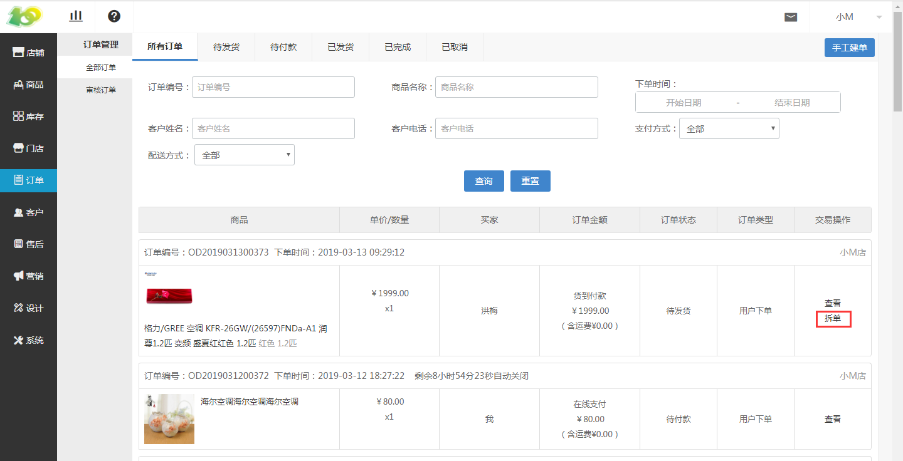
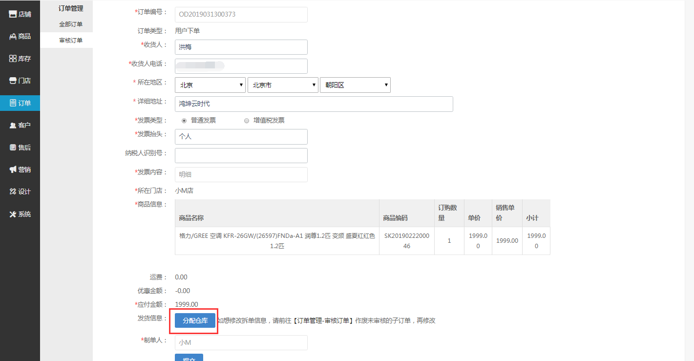
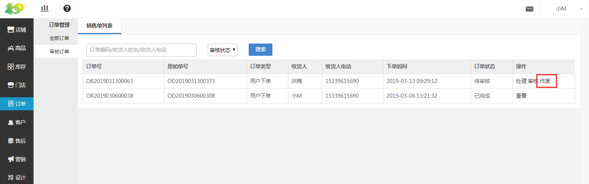
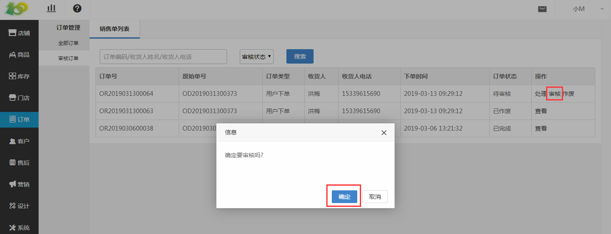
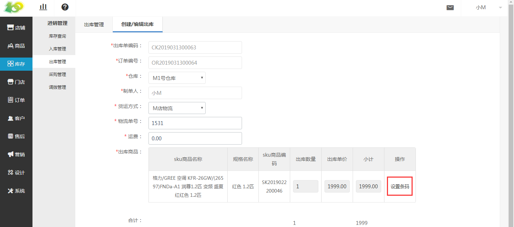
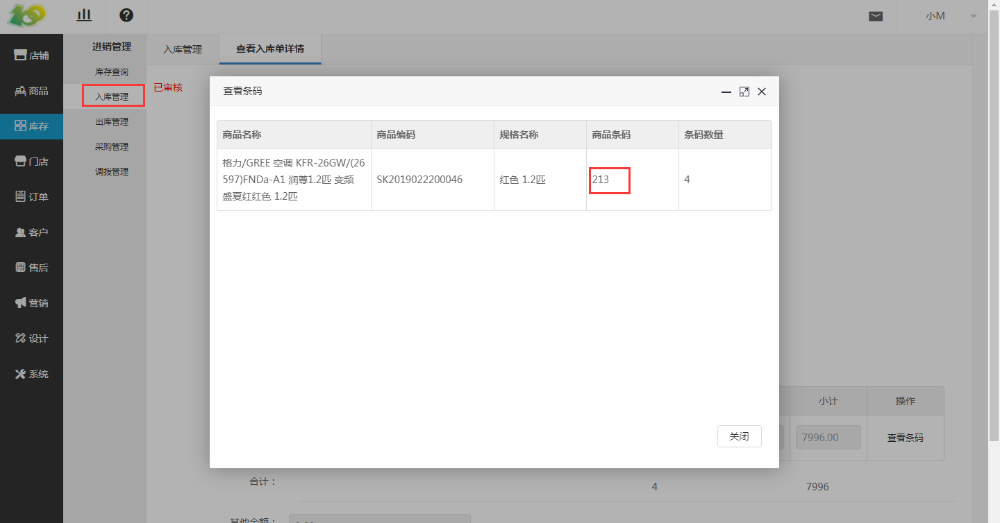
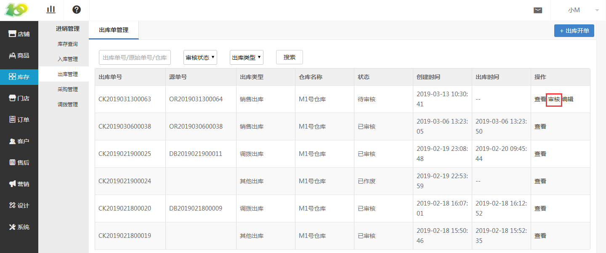

# 一、全部订单

### 发货（拆单）

*   用户下单后，在 订单-订单管理-全部订单 中，可以查看用户的下单记录

*   点击 拆单 ，可以进行发货

* 在拆单过程中，我们必须要做的是选择 分配仓库 ，其余信息我们只需核对修改即可

* 若想修改拆单信息，请前往 订单管理-审核订单 作废未审核的子订单，再修改

*   点击 处理 ，可查看当前拆单的信息

*   若确认无误后，可点击审核，进行发货

*   点击 库存-进销管理-出库管理-编辑 ，设置出库商品的条码以及发货的物流

*   商品的条码，为入库时的商品条码

*   点击 库存-进销管理-出库管理-审核 ，进行商品的出库

* 审核后，商品即出库成功（发货成功）
