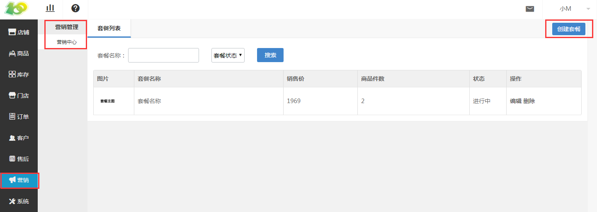
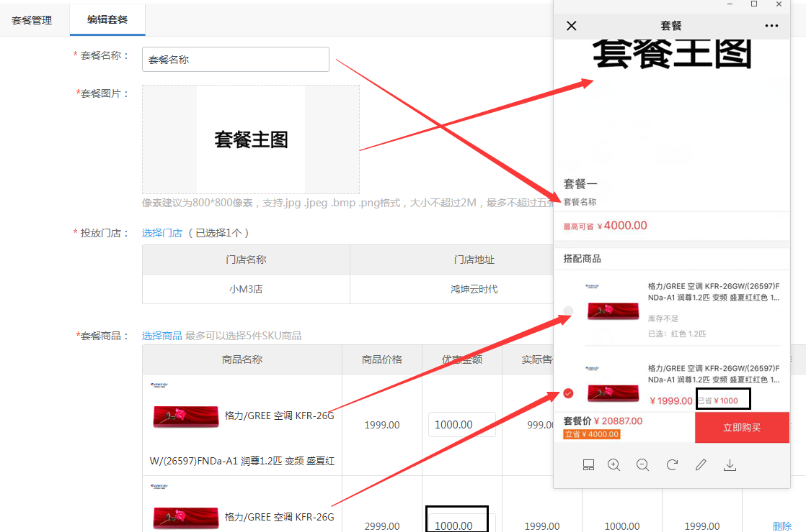
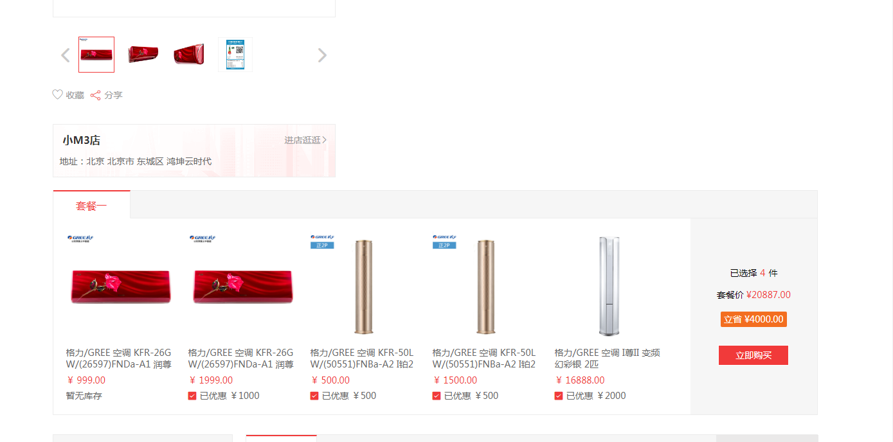

# (2)创建套餐

*   点击 营销-营销管理-套餐-创建套餐 ，进行套餐的创建，按引导语操作完成套餐创建即可

*   没有库存的商品在套餐中不可购买

*   下方有套餐活动在前台页面显示的情况

*   微信端通过任意一个套餐中的商品可进入套餐页面，点击购买套餐后，即可进入套餐活动页面，用户在勾选后进行购买即可

*   PC端通过任意一个套餐中的商品的详情页均可看到套餐信息，PC端不会显示套餐主图

