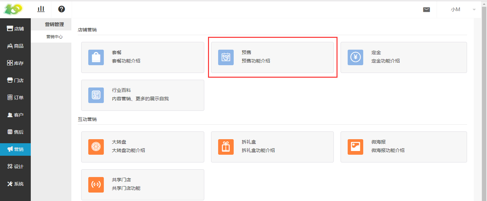
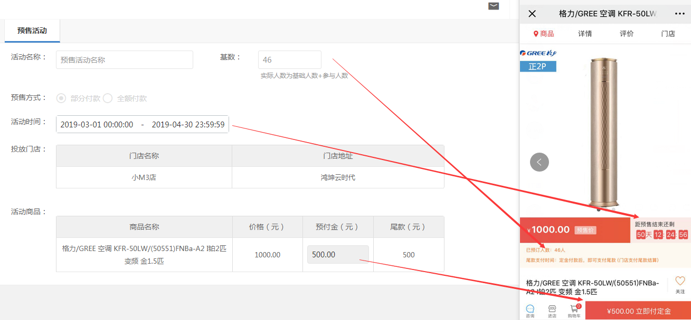
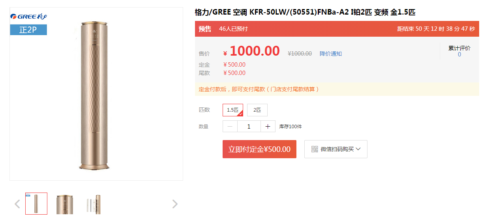
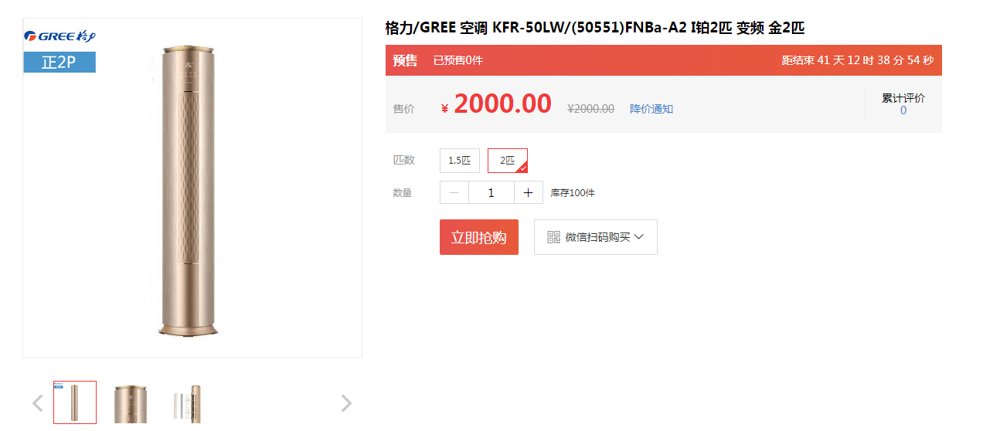
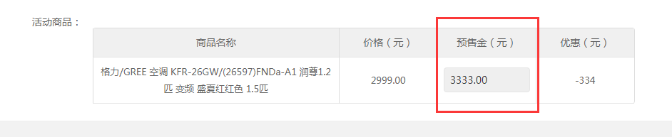

# (1)创建预售活动

*   点击 营销-营销中心-预售 ，进行预售活动的创建

*   根据下图提示进行创建即可，其中预售方式分为两种
    部分付款：需要先支付定金随后支付尾款，其中尾款需到门店支付，不在平台支付
    全额付款：需一次性付款，和正常购买东西的流程是一样的

*   注意事项：其中预售金额可以大于商品本身的价格

*   由于是预售商品，可以利用饥饿营销提升我们的商品价格

