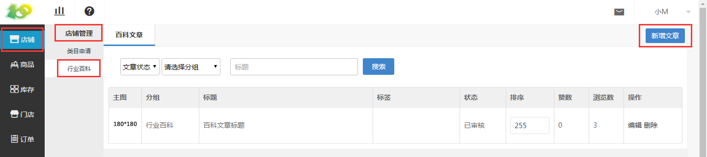
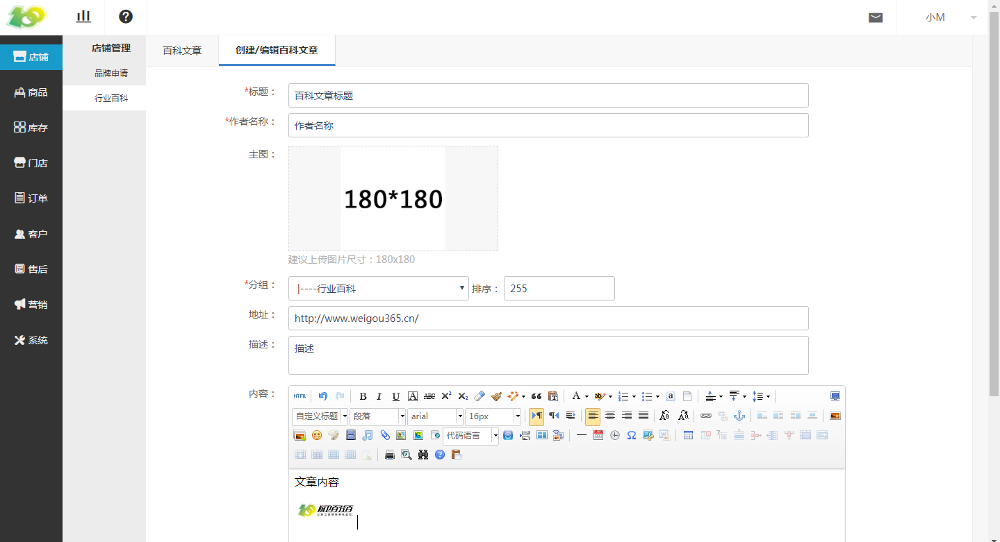
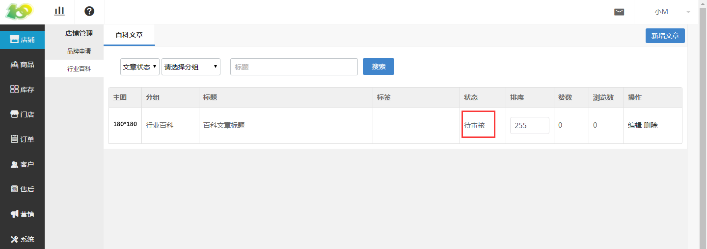
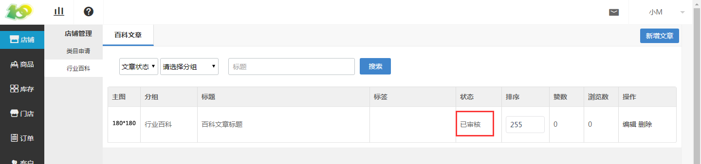
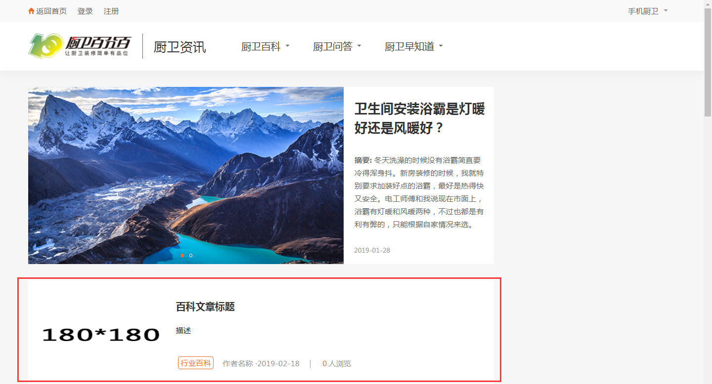

# (1)创建百科文章

*   点击 营销-行业百科-新增文章 ，进行行业百科文章的创建

*   按照文章信息进行添加即可，填完后点击提交，等待厨卫百分百的工作人员进行审核，审核状态下显示 待审核 ，审核完成后即显示 已审核 。

*   已审核过的文章，会在厨卫百分百前台显示，可在官网的 厨卫资讯 下查看。

注意事项：

*   若添加了地址，则文章内容不会在前台显示，点击文章标题后即跳转该地址；

*   若想显示文章内容，请不要输入地址。

