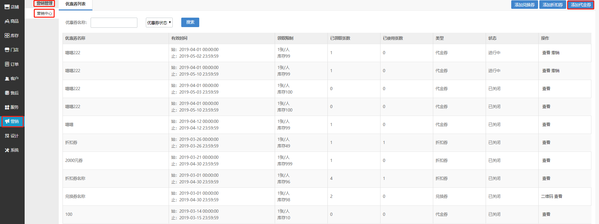
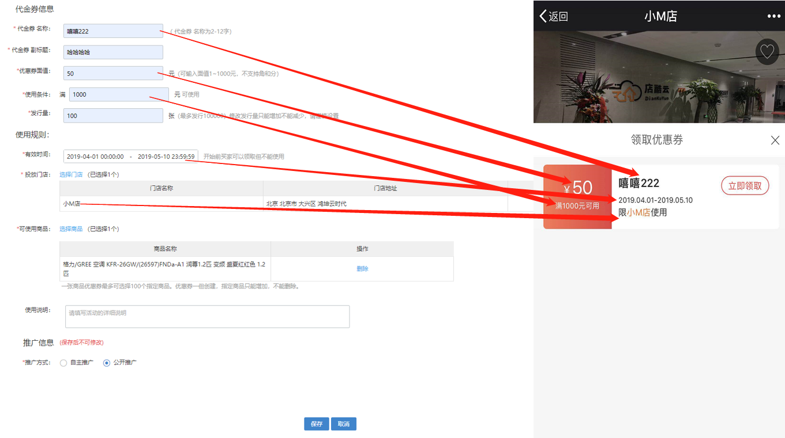
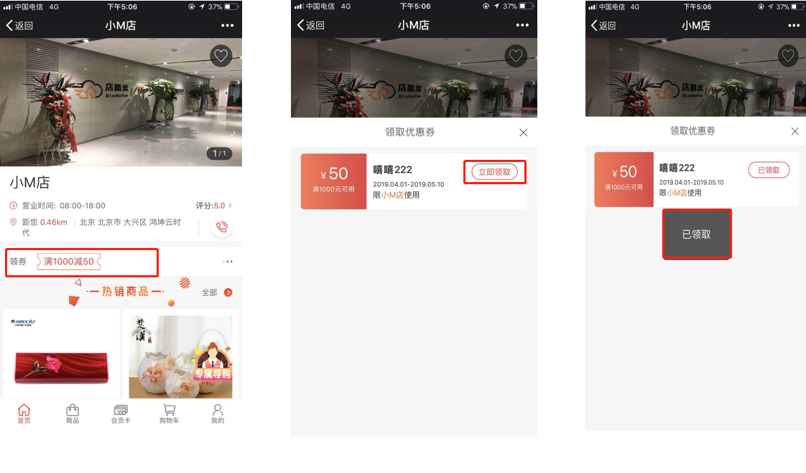
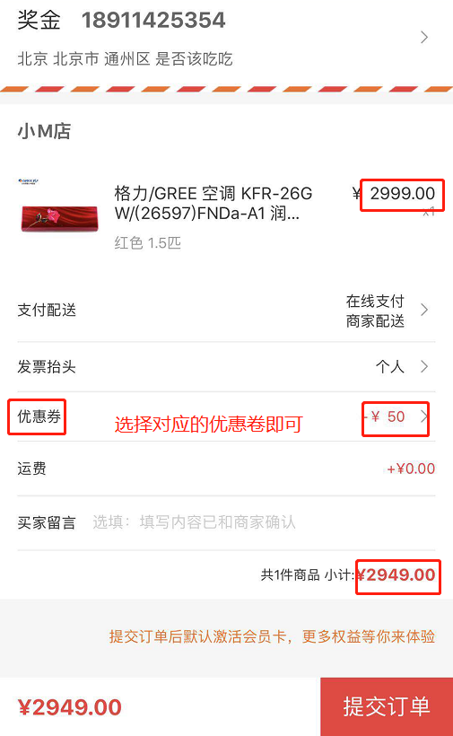

# (1)创建优惠卷

* 点击  营销-营销管理-营销中心-添加优惠卷 ，进行优惠券的创建

*   优惠卷名称：根据实际情况填写即可，显示位置如下图

*   优惠卷副本：根据实际情况填写即可

*   优惠卷面值：参照活动力度根据实际情况填写即可，要跟使用门槛对应，显示位置如下图

*   发行量：前台不显示，根据对应库存及实际情况填写即可

*   使用条件：看根据设置的优惠卷面值设置使用门槛，显示位置如下图

*   有效时间：根据实际情况填写即可，显示位置如下图

*   投放门店：根据实际情况填写即可，显示位置如下图

*   可使用商品：指定商品可以使用此优惠卷，其他商品不能使用优惠卷

*   推广方式：上边已经介绍过，根据实际情况设置即可

*   手机端优惠卷界面
    * 图一：门店下进入领卷的页面
    * 图二：优惠卷领取页面
    * 图三：优惠卷领取成功页面

*  用户使用优惠券购买商品（如下图）

