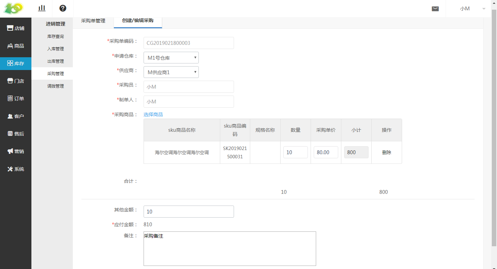

# (1)创建采购单

*   点击 库存-进销管理-采购管理-创建 采购单 ，进行采购单的创建

*   采购单编码：自动生成的，是单据的编码，唯一识别单据的信息。类似于订单号一样。

*   申请仓库：一般是哪个仓库缺货，需要采购进货，所以采购单由仓库申请，按需选择即可

*   供应商：即采购的商品是由哪个供应商提供的，按需选择即可

*   采购员：会默认选择当前创建采购单的后台操作人员，仅作为记录使用，若有问题方便及时找到采购人员

*   制单人：会默认选择当前创建采购单的后台操作人员，仅作为记录使用，若有问题方便及时找到制单人员

*   采购商品：点击 选择商品 进行添加需采购的后台商品，若要采购新商品，请先到后台进行商品录入

*   合计：即所需采购商品的价格总额

*   其他金额：例如物流费用、人工运输费用等

*   应付金额：即 合计+其他金额 的总金额

*   备注：按需填写即可

