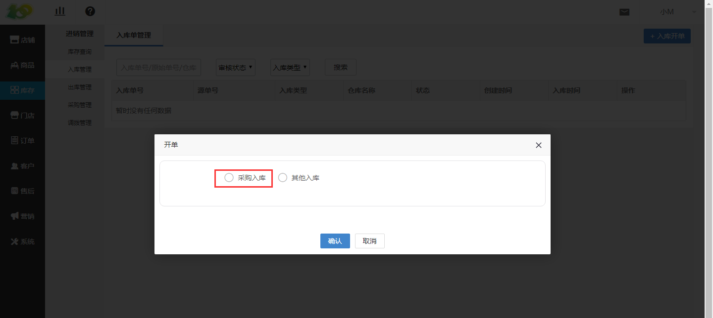
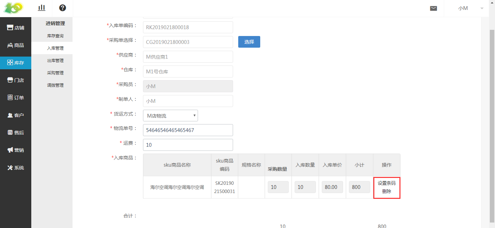
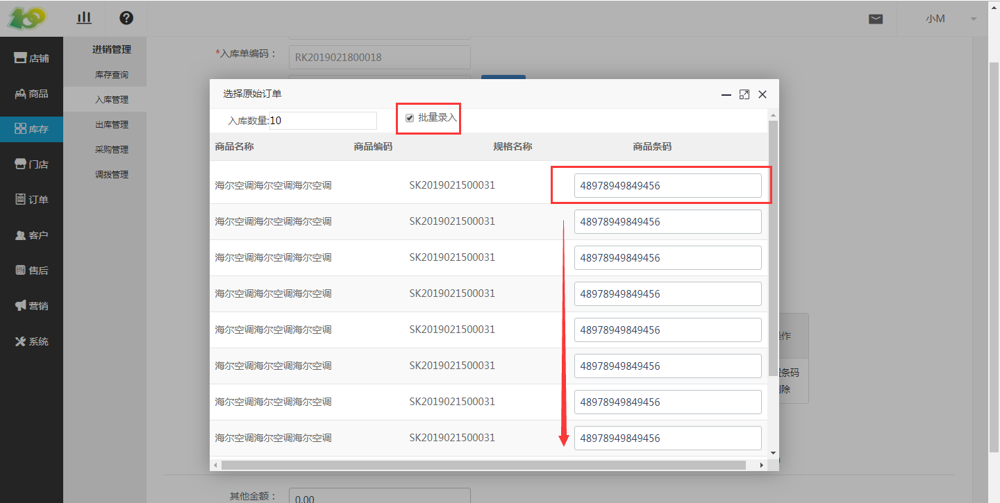

# (1)采购入库单
*   入库单类型：根据创建入库单时的选择进行显示

*   入库单编码：自动生成的，是单据的编码，唯一识别单据的信息。类似于订单号一样。

*   采购单选择：根据采购入库需要入库的进行采购单选择

*   其中供应商、仓库、采购员、制单人在创建采购单时选择过了，在此处只会显示

*   货运方式、物流单号、运费、入库商品、合计、其他金额、应付金额、备注 根据实际信息进行填写即可，其中部分须填项已在创建采购单时讲过了

*   设置条码：此项为必填的，如果不填的话审核是无法通过的，因为入库的商品较多，点击批量录入按钮后，输入第一行的商品条码后，单击框内的任意地方后，可以批量设置商品条码

*   入库数量：在点过设置条码的左上角进行输入

*   一个采购单上的商品可以进行部分入库，比如有10件商品，可以第一次给仓库入5个商品，第二次再入5个

