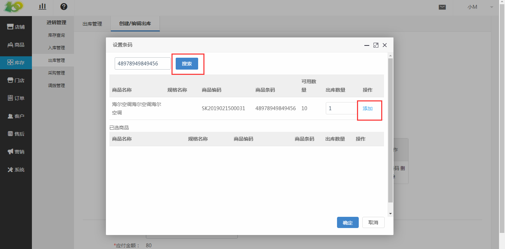

# (1)创建出库单

*   点击 库存-进销管理-出库管理-出库开单 ，进行出库单的创建

*   出库单编码：自动生成的，是单据的编码，唯一识别单据的信息。类似于订单号一样。

*   仓库：根据实际需要出库的商品所在的仓库进行选择

*   制单人：会默认选择当前创建出库单的后台操作人员，仅作为记录使用，若有问题方便及时找到制单人员

*   货运方式：根据实际情况选择即可，创建物流的方法，上面文档有介绍

*   物流单号、运费：根据实际情况填写即可

*   出库商品：选择的商品是仓库中现有的商品，选择后记得设置商品条码

*   设置条码：首先需要在搜索框中 输入商品条码 ，此商品条码为商品入库时设置的商品条码，可以用枪扫码，扫描到系统中，然后点击 搜索 ，再输入出库的 商品数量 后，点击 添加 后，点击 确定 即可，若添加错误商品，可点击 移除 删除添加的商品信息。

*   合计：为 出库商品 价格的总和

*   其他金额：例如物流费用、人工运输费用等

*   应付金额：即 合计+其他金额 的总金额

*   备注：按需填写即可

