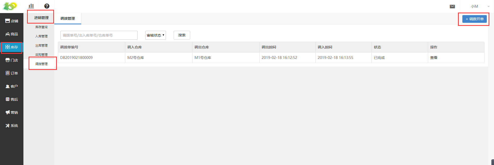
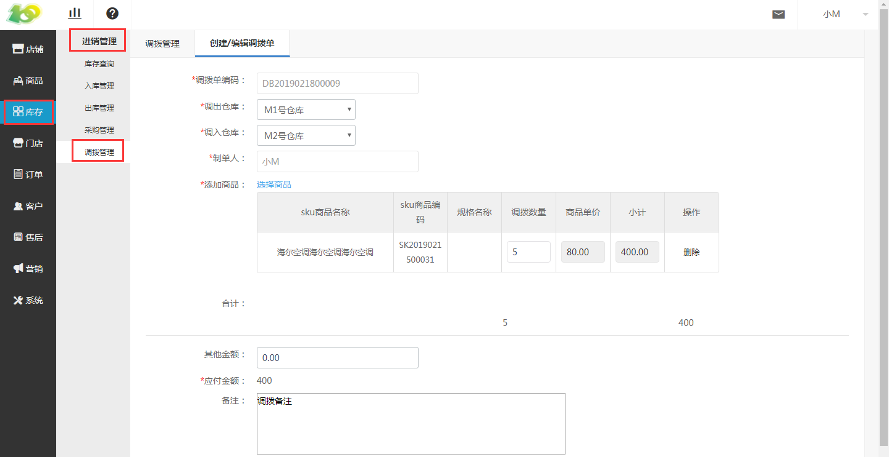

# (1)创建调拨单

*   点击 库存-进销管理-调拨管理-调拨开单 ，进行调拨单的创建

*   调拨单编码：自动生成的，是单据的编码，唯一识别单据的信息。类似于订单号一样。

*   调出仓库：根据实际情况选择 调出商品所在的仓库 即可

*   调入仓库：根据实际情况选择 商品所要调入的仓库 即可

*   制单人：会默认选择当前创建调拨单的后台操作人员，仅作为记录使用，若有问题方便及时找到制单人员

*   添加商品：根据实际情况选择需要调拨的商品即可，此商品为在仓库中记录的商品

*   合计：为 调拨商品 价格的总和

*   其他金额：例如物流费用、人工运输费用等

*   应付金额：即 合计+其他金额 的总金额

*   备注：按需填写即可

