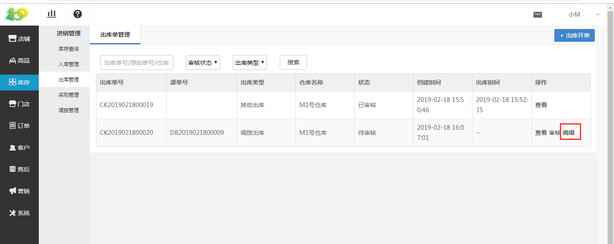
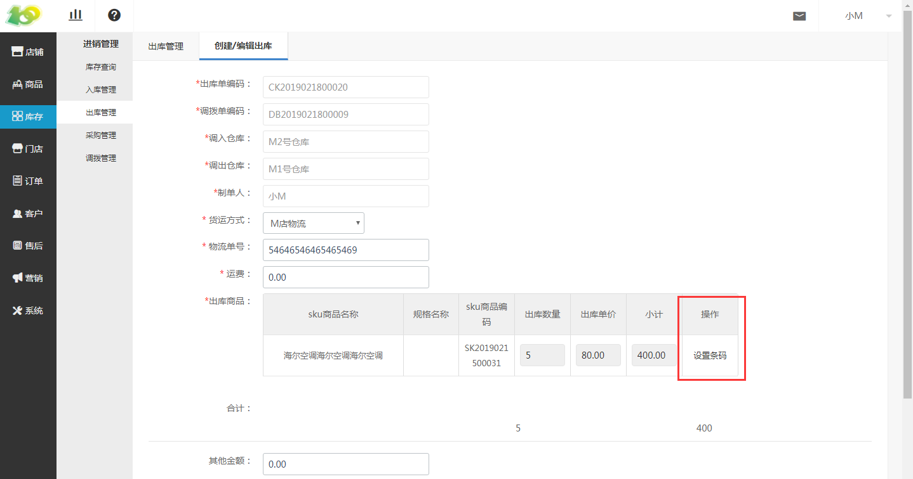
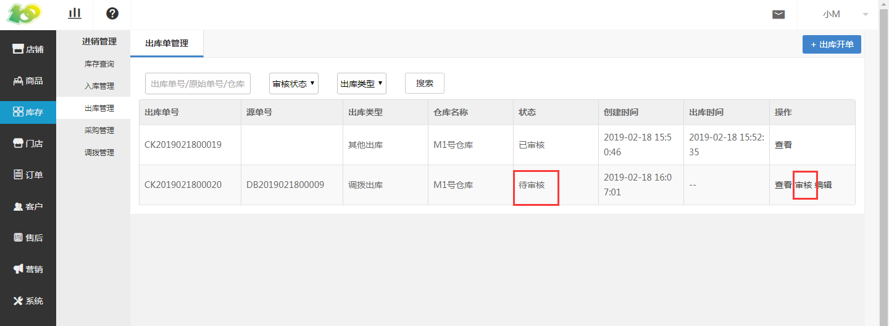
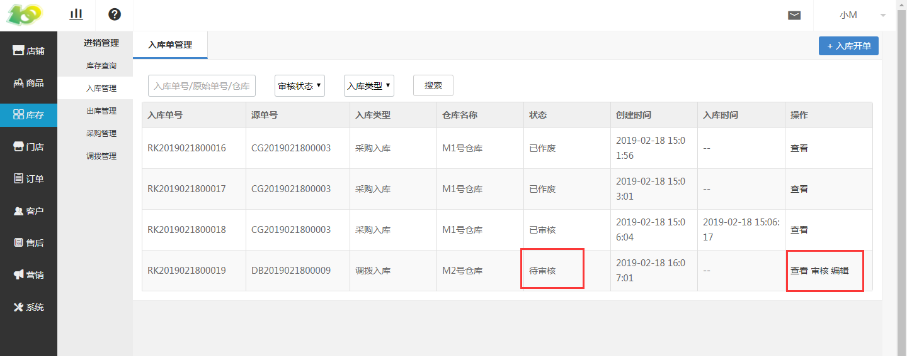

# (4)编辑出库单及入库单

*   由于商品调拨后，会生成出库单和入库单，所以需要编辑出库单以及入库单

*   点击 库存-进销管理-出库管理-编辑 ，进行出库单的编辑

*   进行 出库单审核 后，编辑 调拨的入库单 ，然后 审核入库单 ，审核通过后，即完成了一次调拨。

*   与 创建出库单 类似，根据实际情况填写过相关信息、添加过出库商品后， 提交 即可

*   提交后依旧进行 审核 步骤

* 入库单与出库单相同，需要编辑、审核后即成功的完成了一次商品调拨

