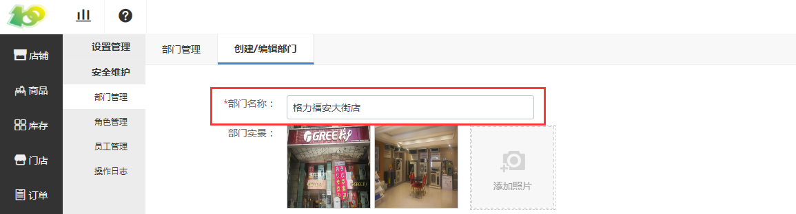

# (1)部门名称

*   不能为空，15个汉字或30个英文字符内，不能含有括号和特殊字符；

*   仅为商户（品牌）名称，如海底捞，苏宁电器，华景国旅，茂业百货；

*   不应包含地区、地址、分店名等信息；

*   由于之后店名将直接展示给用户，因此也请不要出现“xxx有限责任公司”、“xx连锁有限公司”等与业务不直接相关的字样。

注意事项：

*   可以取名为格力福安大街旗舰店、欧贝斯居然之家玉泉营店、德恩特南山超市店类似的；

*   后续审核如果 门店名不符合规范 ，微信平台会 审核不通过 。

