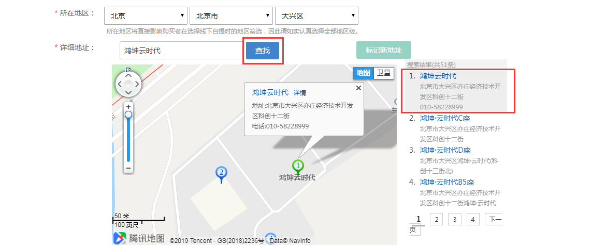

# (6)所在地区及详细地址

*   所在地区：根据实际情况进行选择即可

*   详细地址：

*   准确填写门店所在地址和门牌号，务必至少包括“XX路XX号”这一基本信息；

*   因为无法检索和定位，请不要只填写“XX楼下”、“XX左侧100米”、“XX商厦首层”、“XX地铁站D出口向北100米”这类的信息，如要保留，请先保证门牌号准确填写；

*   请不要在“详细地址”字段中重复填写省市区信息

注意事项：

*   点击搜索门店后，若搜不到，请点击标记新门店手动进行标记

*   请正确选择门店所在地进行标记，避免微信端审核不通过

