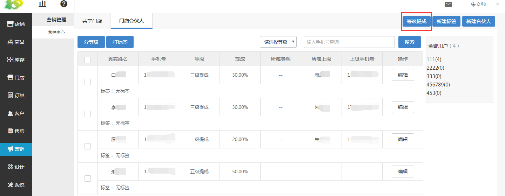
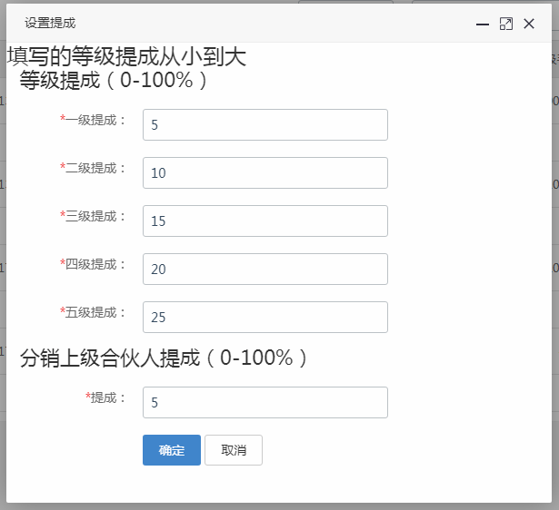

# (1)新建登记提成

*   点击 营销-营销中心-合伙人-等级提成 ，进行等级提成的设置

*   等级提成：一级合伙人拿到的提成，即发展用户的合伙人拿到的提成

*   分销提成：二级合伙人拿到的提成，即发展了用户的合伙人的上级拿到的提成

    *   举例：合伙人B是具备三级提成，合伙人C发展的合伙人B，合伙人C具备五级提成，用户A扫了合伙人B的二维码，领取了奖品后，到店内消费了，合伙人B拿到三级提成，合伙人C拿到分销提成。

