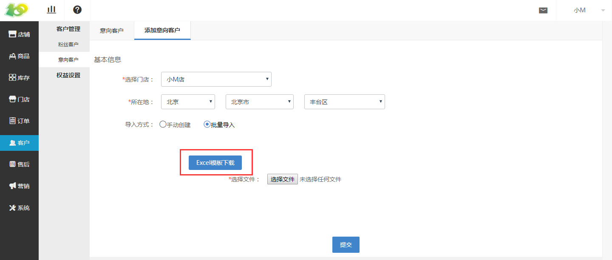
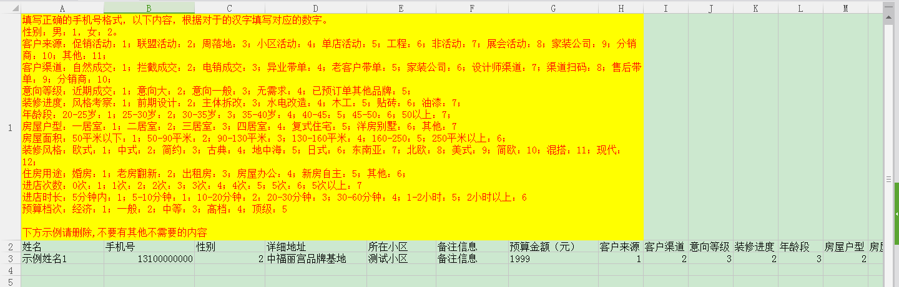

# (2)导入意向客户

*   点击 客户-客户管理-意向客户-导入客户 ，可进行意向客户的批量导入

*   根据实际情况，填写表格，点击 Excel模板下载 ，可将模板文件下载到电脑中

*   按照模板文件中的示例进行填写信息即可，在最后保存时请删除第一行示例文字，不然第一行的示例客户信息会录入到系统中

注意事项：

*   批量导入需按照地区进行导入（即 一个地区一个地区的批量导入）

