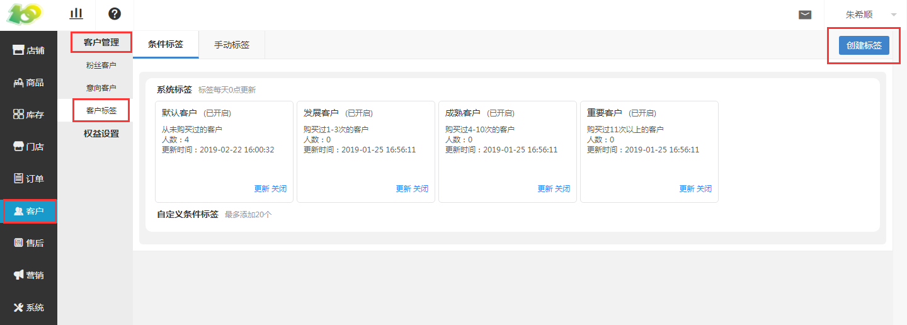
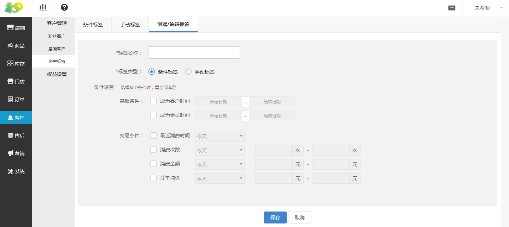

# (1)条件标签

*   点击 客户-客户管理-客户标签-条件标签-创建标签 ，可进行条件标签的创建

*   根据实际需求创建条件标签即可，若用户满足此条件，会自动分配到该标签下

*   系统自带四个条件标签

*   点击 更新 会将用户重新筛选一遍，再分配到各个标签下

*   点击 关闭 会将该标签关闭，该标签即不可再使用，若想重新启用，点击 开启 即可

*   标签每天0点更新：因为会发生新的粉丝进来、粉丝状态改变等情况，所以粉丝绑定到标签下需要刷新，系统每天0点会自动刷新

